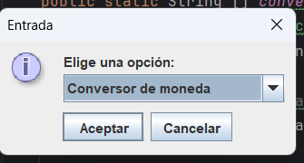
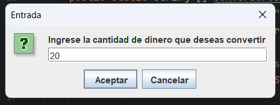
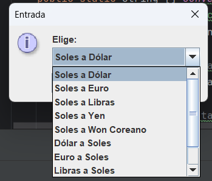
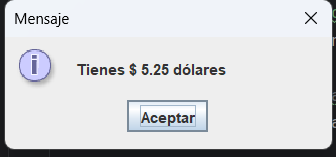
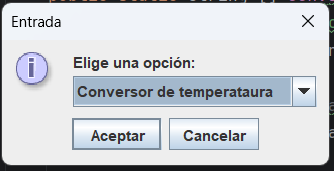
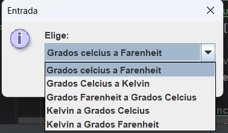
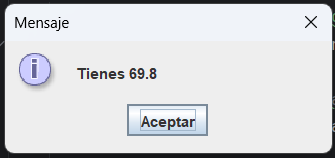
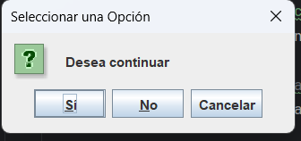

# Aplicación de Conversión: Challenge ALURA

# Challangue

Challangue es una aplicación de escritorio que te permite convertir entre diferentes tipos de monedas y temperaturas. Proporciona una interfaz simple y fácil de usar para realizar conversiones rápidas y precisas.

## Características

- **Conversión de Monedas**: Convierte entre múltiples tipos de monedas usando las tasas de cambio más recientes.
- **Conversión de Temperaturas**: Convierte entre Celsius, Fahrenheit y Kelvin.
- **Resultados Precisos**: Asegura resultados exactos para todas tus conversiones.

## Instalación

### Requisitos Previos

- Sistema Operativo: Windows
- Java 8 o superior
- Bibliotecas necesarias: `GSON`
- Conexion a internet para el uso de la API

## Instrucciones de Uso

1. Ejecuta la aplicación.
2. Selecciona el tipo de conversión que deseas realizar: moneda o temperatura.
3. Ingresa el valor que deseas convertir.
4. Selecciona la unidad de conversión.
5. La aplicación mostrará el resultado de la conversión.

## Capturas de Pantalla

### Conversión de Monedas

### Conversión de Temperaturas

## Captura de continuar o salir

